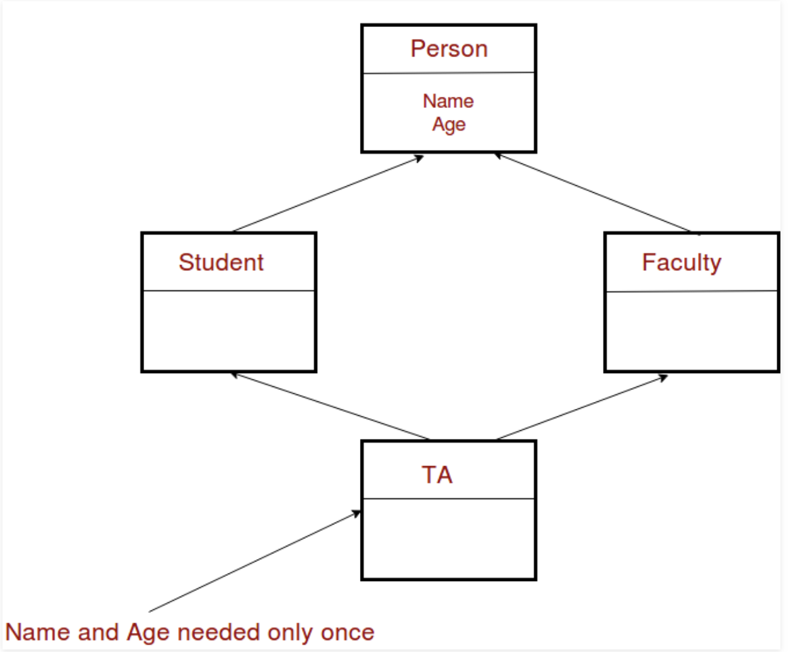

# Day03 Notes

- [Day03 Notes](#day03-notes)
	- [Inheritance](#inheritance)
	- [Virtual Functions](#virtual-functions)
		- [Virtual destructors](#virtual-destructors)
	- [Diamond problem](#diamond-problem)

## Inheritance

- A way to make classes relate to each other so that the child will have the same attributes as the parent
  
```
class Animal {
private:
	int _nLegs;

public:
	Animal(void);
	Animal(Animal const &src);
	~Animal(void);

	Animal	&operator=(Animal const &src);

	void	run(int distance);
	void	call(void);
	void	eat(std::string const &what);
	void	walk(int distance);
};

class Cat : public Animal {
public:
	Cat(void);
	Cat(Cat const &src);
	Cat& operator=(Cat const &src);
	~Cat(void);

	void scornSomeone(std::string const &target);
};

class Pony : public Animal {
public:
	Pony(void);
	Pony(Pony const &src);
	Pony& operator=(Pony const &src);
	~Pony(void);

	void	doMagic(std::string const &target);
	void	run(int distance);
};
```

- Both `Pony` and `Cat` inherit all the attributes adn functions from animal
- In `Pony` we are overriding the run method into a new one
- When a child is created you need to instantiate the parent first and then instantiate the kid
  - Same when you destroy it `delete`
- Class scopes:
  - `public` = Accesible from anywhere
  - `protected` = Accesible from the object and their children
  - `private` = accesible only from the object
- Types of inheritance:
  - **Single**: When you inherit from only one class
  - **Multiple**: When you inherit properties and behaviors from more than 1 class
  - **Hierarchical**: When many classes inherit from the same one
  - **Multilevel**: When a class inherits from a class that is already inheriting other one
  - **Hybrid (aka diamond)**: When you inherit from different classe and all this classes where inheriting from a single class
- Encapsulation levels of inheritance is the way you inherit from a class, it can be:
  - **`public`**: public members of the base class stay public in the child and protected stay protected in the new class
  - **`protecter`**: Both public and protected members become protected members of the child class
  - **`private`**: Public and protected members of the base class become private in the child class
- In order to call the constructor or  any other function from the base class you do: `BaseName::Function()`
  - Same for attributes
  - Constructors and destructors need to be called by ourselves right now because we haven't learned what `virtual` is.
```
class Parent {
private:
	int _n;
public:
	Parent(int n);
	~Parent(void);
};

class Child : public Parent {
public:
// This
	Child(int n) : Parent(n) {
		return ;
	}
// Or this is also accepted
	Child(int n) {
		Parent::Parent(n);
		return ;
	}

	~Child(void) {
		Parent::~Parent();
		return ;
	}
};
```

---

## Virtual Functions

- Is a member function which is declased within a base class and then is overriden in a derived class.
- This is mostly used for polymorphism because you create a pointer of the base class which can point to any child class.
  - Without the `virtual` part, if you called a function which is both defined in the base class and in the child class then you would run the base class function.
  - With the `virtual` function when you call the function in the runtime the program will look what the pointer is pointing to (base class or child class) and run the correct function.
- Rules for virtual functions:
  - Cannot be static and cannot be a friend function of another class
  - This functions must be accessed using a pointer or a reference of the base class type to achieve run time polymorphism
  - The prototype of virtual functions should be the same in base ad in derived clas
  - They are always defined in base class and then overriden in child class.
    - It is not mandatory for a child class to override the function. If it is not overriden then the base class function will be run.
  - A class can have a virtual destructor but not a virtual constructor
  - When creating a `virtual` funciton on the base class you don't need the `virtual` keyword on the derived class
```
// CPP program to illustrate 
// concept of Virtual Functions 
#include<iostream> 
using namespace std; 

class base 
{ 
public: 
	virtual void print () 
	{ cout<< "print base class" <<endl; } 

	void show () 
	{ cout<< "show base class" <<endl; } 
}; 

class derived:public base 
{ 
public: 
	void print () 
	{ cout<< "print derived class" <<endl; } 

	void show () 
	{ cout<< "show derived class" <<endl; } 
}; 

int main() 
{ 
	base *bptr; 
	derived d; 
	bptr = &d; 
	
	//virtual function, binded at runtime 
	bptr->print(); 
	
	// Non-virtual function, binded at compile time 
	bptr->show(); 
}

PRINTS:
print derived class
show base class
```

- This simple program shows how virtual functions work on the reality
- **`virtual` keyword must only be used in the class declaration**
  - In other words, use it in the hpp, not the cpp

### Virtual destructors

- Destructor have a special case of virtual functions because they don't need to have the same name to be overriden in the derived class
  - And they are not actually overriden, but adding the `virtual` keyword forces the program to delete both the child and the parent class

```
// A program with virtual destructor 
#include<iostream> 

using namespace std; 

class base { 
public: 
	base()	 
	{ cout<<"Constructing base \n"; } 
	virtual ~base() 
	{ cout<<"Destructing base \n"; }	 
}; 

class derived: public base { 
public: 
	derived()	 
	{ cout<<"Constructing derived \n"; } 
	~derived() 
	{ cout<<"Destructing derived \n"; } 
}; 

int main(void) 
{ 
derived *d = new derived(); 
base *b = d; 
delete b; 
getchar(); 
return 0; 
} 

PRINTS:
Constructing base
Constructing derived
Destructing derived
Destructing base
```

## Diamond problem

- When you have two superclasses that have a common base class and you try to use the childclass, you will run into the problem that the common base class constructor will be run 2 multiple times, creating 2 copies of all the attributes, causing ambiguitites.



- In order to solve this, when you inherit on the middle level class you will add `virtual` keyword in the inheritance
  - `class Student: virtual public Person`
```
#include<iostream> 
using namespace std; 
class Person { 
public: 
	Person(int x) { cout << "Person::Person(int ) called" << endl; } 
	Person()	 { cout << "Person::Person() called" << endl; } 
}; 

class Faculty : virtual public Person { 
public: 
	Faculty(int x):Person(x) { 
	cout<<"Faculty::Faculty(int ) called"<< endl; 
	} 
}; 

class Student : virtual public Person { 
public: 
	Student(int x):Person(x) { 
		cout<<"Student::Student(int ) called"<< endl; 
	} 
}; 

class TA : public Faculty, public Student { 
public: 
	TA(int x):Student(x), Faculty(x), Person(x) { 
		cout<<"TA::TA(int ) called"<< endl; 
	} 
}; 

int main() { 
	TA ta1(30); 
} 
```